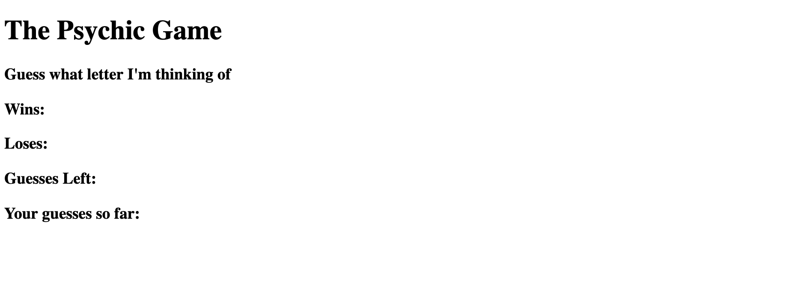

# Psychic-Game
A letter guess game that asks user to pick a letter. If the letter matches the random letter generated by the computer, the user wins and a new letter is generated! If the letter does not match, the user can try again up to 5 times. If the user cannot guess the correct letter in 5 tries, the user loses and a new letter is generated :( 

# Technologies Used 
    * HTML 
    * CSS
    * JavaScript 
    * Bootstrap 

# Concepts Learned
    * Value of pseudocoding
    * Loops, arrays, functions
    * onkeyup 
    * getElementById 
    * console.log

# Authors 
    * Megha Bindiganavale 
